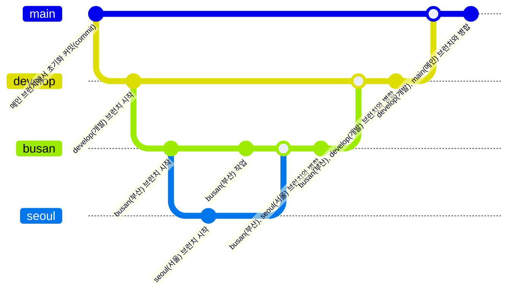

# 스파 CRM 프로젝트

## 참고

```shell
yarn report
```

위 커맨드를 실행해서 analyse.html 를 통해서 각 모듈의 bundle size를 확인하실수있습니다. 불필요하다 여기시는 라이브러리는 제거하시면 됩니다.

## 주요 사항 [코드컨벤션]

- 코드컨벤션은 google file convention을 사용하고 있습니다. https://google.github.io/styleguide/jsguide.html
- 완벽하게 따라한것은 아니지만 파일명을 google javascript convention을 따라가려고 하였습니다. airbnb로 채택하지 않은 이유는 아래와 같습니다.
  https://www.notion.so/938-react-438c9cb169df42a3bedd6e04a89e920f

## 주의 사항

- shadcn 명령어를 사용할때 기존에 있는 컴포넌트가 존재 하는지 확인
- 각각 develop 브런치에 옮기기전 busan, seoul 브런치를 병합 후 pull request 진행
- 상대 브런치를 pull 진행 후 package.json 확인 후 추가적인 라이브러리가 있다면 npm install, yarn install, pnpm install 수행
- 폴더 이름과 파일 이름은 대시 케이스로 작성

```js
// -- 기본

// 페이지 파일
file - page.tsx;
// api 파일
file - api.ts;
// atom
file - atom.ts;
// 기본 파일 [나머지]
component.tsx;

// -- '.' 으로 구분하는 파일

// 스타일 파일
style - file.styled.ts;
// type 파일
file.type.ts;
```

- 코드켄벤션
  1. @typescript-eslint/naming-convention -> 변수명, 함수명, 클래스명 등등 네이밍을 강제합니다. <br/>
  2. filename-rules/match -> 파일명에서 kebab-case & dash-case를 강제합니다. | 사용한 이유는 ci/cd에서 git이 대소문자를 무시하고 들어가는 경우가 있습니다 물론 제어할수있지만 제어하지 않았다면 그런 문제가 생기기 때문에 사용하게 되었습니다.<br/>
  3. import/order -> import 순서를 강제합니다. | 사용한 이유는 import 를 깔끔하게 만들기 위해서 입니다. <br/>
  4. @typescript-eslint/no-unused-vars -> 안쓰는 변수명에 경고를 뜨웁니다. 향후 쓸 예정이면 \_ 를 앞에 prefix 해야합니다. <br/>
  5. 나머지는 .eslint.cjs 참고

## 주요 라이브러리

- 클라이언트상태관리: jotai <br/>
  많은 라이브러리중 선택한 이유는 zustand와 많이 고민했지만 zustand는 웹에서 굉장히 좋은 모습을 보입니다. redux에 익숙해 있는 사람들은 바로 적응할수있고 좋지만 react-native에서 좋은 효과를 보지 못했습니다. react-query와 연계하여서 refetch가 제대로 되지 않는 현상들이 zustand를 쓰면 있었습니다 예를들면 zustand로 asyncStorage와 secureStorage를 다룰때 refetch가 원활이 이루어지지 않아서 따로 useCallback으로 묶어서 의존성 배열에 두고 리랜더링을 시켜야하는 방법으로 구성해야합니다. 할수는 있지만 매우 번거롭다고 느꼈습니다. 문두에 쓴 "웹"에서는 좋다는것은 웹만 사용한다면 zustand를 써도 괜찮겠지만 목표는 모든면에서 하나를 배우면 다 사용하고 싶다 라고 생각하였습니다. 자유도가 높아 코드컨벤션을 맞추기 어렵다가 atomic 패턴에 문제이자 jotai의 단점이라면 이 부분은 회사 내규에 맞춰서 구성을 해두면 되는 것이라서 문제가 되지 않을거 라고 생각합니다. jotai를 사용했을때는 그런 현상이 없습니다. 웹에서도 잘 동작합니다 devtools도 존재합니다. 현재 프로덕션으로 사용하지 않을 이유는 없다고 생각합니다.

- 서버상태관리: react-query <br/>
  많은 라이브러리중 선택한 이유는 활용도가 높고 유지보수가 굉장히 활발하며 쉽게 사용할수있고 vue,angular,svelte 에서도 사용할수있고 나아가 nextjs에서도 활용 할 수 있기 때문에 배워두면 다양하게 활용 가능할것으로 보여 선택했습니다.

- 데이터가공: lodash-es <br/>
  데이터가공에 있어서는 정말 탁월하고 많은 프로젝트에서도 사용되고 있습니다. 주력으로 사용하는 이유는 함수의 안정성이 좋다고 생각해서 입니다. esnext api 보단 성능이 떨어지지만 그래도 esnext api에서 터지는 현상을 소수 발견하여 현재 주력으로 사용하고 있습니다.

- UI작업: tailwindcss & shadcn/ui & nextui & emotion & twin.marco
  - nextui 같은 경우에는 서브로 사용하고 있습니다. 메인으로 사용했었는데 버그가 있어 예쁘고 간단하게 사용할수있는 부분은 사용하고 아닌 부분은 대부분 shadcn/ui를 사용합니다.
- 날짜관련: dayjs & date-fns & korean-business-day
- form관련: react-hook-form

## create-react-app 대신 create-vite 를 사용한 이유

https://www.notion.so/976-create-react-app-create-vite-2feeca1503c0430eb5fbf5a0ca1a9136?pvs=4

<hr />

## styled 로 구분지어 따로 관리하는 이유 그리고 twin.marco를 사용하는 이유

목표 는 아래와 같습니다.

1. 가독성이 좋아졌으면 좋겠다.
   - styled-components를 사용하면 되지만 @emotion/styled 를 사용한 이유는 bundle size 가 더 적어서 였고 기존에는 jotai-devtools를 사용할때 @emotion/styled 를 설치해야했습니다. (현재는 아님) 그래서 구성을 하였는데 styled-components 좋지만 @emotion/styled로도 가독성이 좋게 구성할수있어 파일을 따로 분리해서 사용하고 있습니다.
2. 다른 스타일 파일과 의존성이 적어졌으면 좋겠다.
   - 따로 파일을 관리하기 때문에 의존성이 적어져서 좋은거 같고 참고한 부분은 xxx.module.scss 를 참고하였습니다.
3. className이 길어져서 어디가 시작이고 끝인지 구분지어졌으면 좋겠다.
   - @emotion/styled를 사용하지 않으면 컴포넌트가 너무 길어지면 어디가 어디의 시작이고 어디가 어디의 끝인지 정말 구분하기가 어렵습니다. 이 부분은 해소하고자 하였습니다.
4. 실수로 적었을 경우 compile 단계에서 에러가 났으면 좋겠다.
   - className으로 그냥 작성할 경우 string 문자열이기 때문에 compile 단계에서 에러가 나지 않습니다. 에러가 나서 꼭 불필요한 부분은 고칠수있도록 하기 위해서 구분하고 있습니다.

## 브런치 구분 (main / develop / busan / seoul / sky)

브런치는 main, develop 에서 하위로 busan 과 seoul(sky)을 따로 두었습니다. 만드는 domain이 겹치지 않기 때문에 이렇게 구성하였고 feature 단위로 또 작업한다면
busan/feature/staff, busan/feature/product 이 처럼 구성해서 하면 됩니다.

- sky는 서울에서 작업하고 있습니다 향후 seoul 로 바뀔수도 있습니다.
- sky 브런치는 deprecated

* main
* develop
  - seoul(sky) (deprecated)
  - busan


